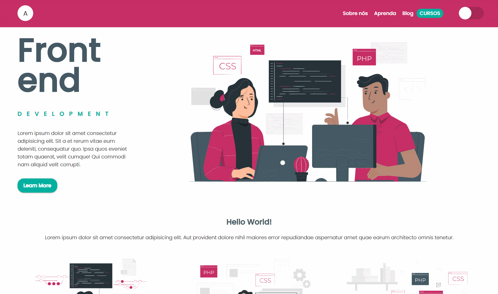

# Grid Flexbox Styled Components e Toggle Theme

Esse é um estudo de Grid,Flexbox, Styled Components e Toggle Theme do React.

<h5 align=center>
 

🎨 Design por [Adriana Lima](https://github.com/dxwebster)

</h5>

<h2 align=center>

</h2>

## 📥 Execute esse projeto no seu computador

- Clonar Repositório: `git clone https://github.com/dxwebster/Grid-Flexbox-and-Styled-Components`
- Ir para a pasta: `cd Grid-Flexbox-and-Styled-Components`
- Instalar dependências: `yarn`
- Rodar Aplicação: `yarn start`

## 📕 Licença

Todos os arquivos incluídos aqui, incluindo este _Readme_, estão sob Licença MIT. 
Criado com ❤ por [Adriana Lima](https://github.com/dxwebster)
